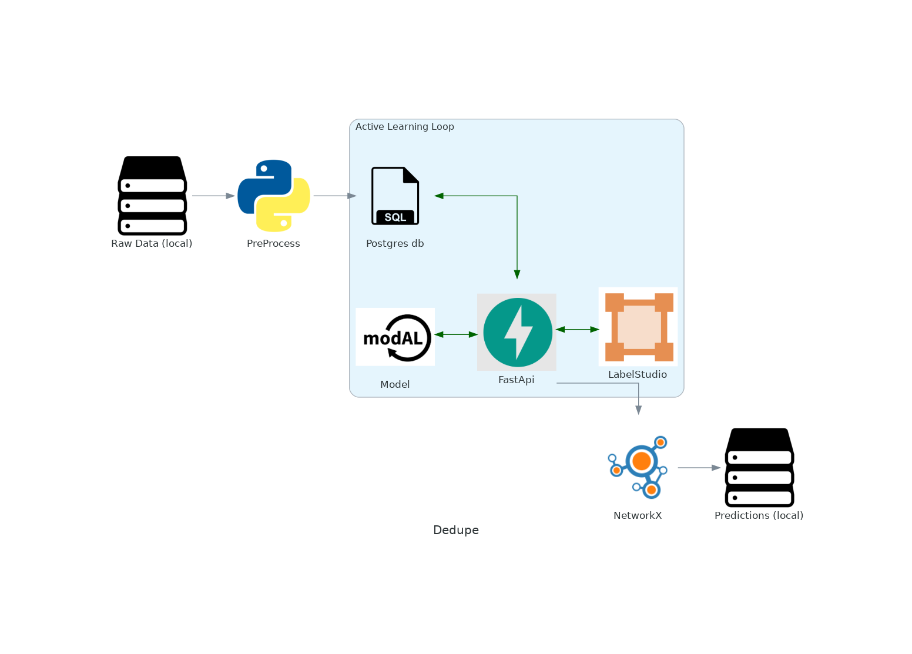

oagdedupe
===================================

**Dedupe** is a Python library for scalable entity resolution, using active learning to learn blocking configurations 
and clasify matches. See :ref:`Getting Started<Installation>` for installation and setup instructions and 
:ref:`User Guide<#user-guide-intro>` for more detailed methodology.

The diagaram below shows an overview of the pipeline.

.. note::
   This project is under active development.

Contents
--------

.. toctree::
   :caption: Getting Started
   :numbered:

   usage/installation
   usage/settings
   usage/dedupe
   usage/recordlinkage

.. toctree::
   :caption: User Guide
   :numbered:

   userguide/Intro
   userguide/glossary
   userguide/sampling
   userguide/blocking
   userguide/distance
   userguide/classifier
   userguide/active_learn_loop
   userguide/cluster

.. toctree::
   :caption: Examples
   :maxdepth: 2

   examples/example_dedupe
   examples/example_rl
   
.. toctree::
   :caption: API Reference
   :maxdepth: 1

   dedupe/api
   dedupe/database
   dedupe/blocker
   dedupe/distance
   dedupe/cluster
