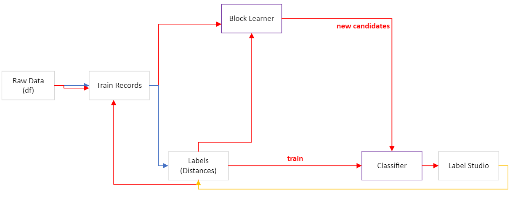
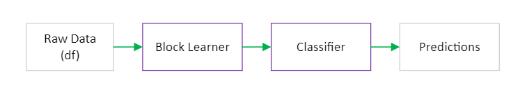

# Active Learning Loop

In the diagram below, the arrows' colors represent the stage of the loop:
- blue: initialization
- red: active learning
- yellow represents the start of a new active learning loop

The image below shows initialization steps in blue and the active learning loop 
in red. 

#### Initialization and First Pass

The initialization steps represent the sampling and fake labelled data 
construction discussed earlier. The train data and fake labelled data 
are used as inputs in the block learner, which evaluates block conjunctions 
based on reduction ratio, positive coverage, and negative coverage.

The block learner applies the best conjunctions to generate comparison pairs. 

The classifier is trained using the labelled data. The comparison pairs from 
the block learner represents the test set and the classifier applies 
uncertainty sampling on this test set to generate candidates for human 
review.

We conduct the human review in label-studio. When a condition is met (
e.g. fewer than 5 tasks remaining in label-studio), fastAPI generates 
new samples, signalling the end of an active learning loop and triggering 
a new one (the yellow arrow).

#### New Active Learning Loop

At the start of a new active learning loop, two events occur:
1. update `train` with new labels
2. delete unlabelled records from `train` and pull a new sample from `df`

And then we repeat: the train data and labelled data (which now 
includes the original fake-construction of labelled data AND outputs from 
label-studio) are used as inputs in the block learner. The best conjunctions 
are evaluated once again, then applied to generate comparison pairs. The 
classifier is updated with new labels and applies uncertainty sampling 
on this fresh batch of comparison pairs. A human reviews on label-studio.

This cycle repeats indefinitely and user can make predictions on the full data 
at any point. (Note that up to this point, we have only been working with 
repeated samples from the raw data. Labels persist through active learning 
loops but train data is resampled at the start of each loop.)

#### Predictions on Full Data

To make comparisons on the full data, we apply the trained block learner 
and classifier directly on the full data:

