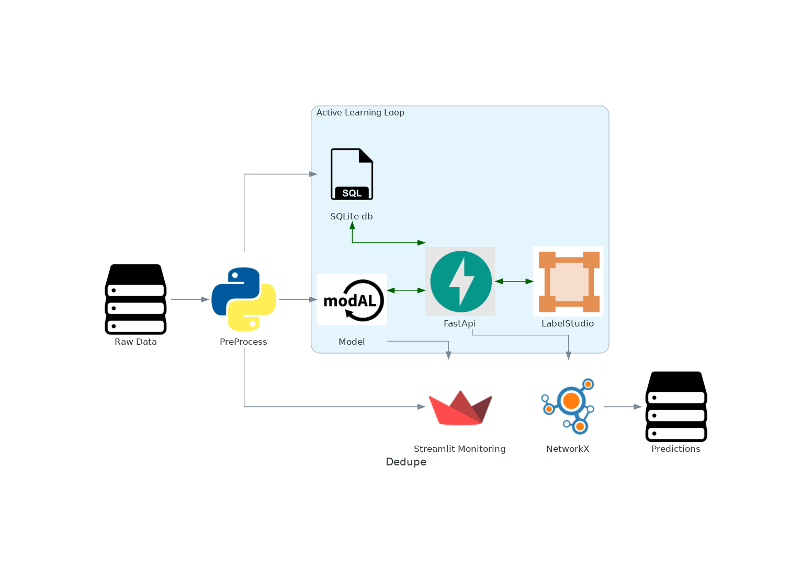

1. Preprocess data (e.g. blocking) to get comparisons
2. Move data and comparison candidates to database
3. Initialize Modal:
    - RandomForest
    - Uncertainty Sampling
4. Active Learn Loop:
    - FastAPI initializes LabelStudio with uncertainty samples
    - When queue is less than 5 tasks:
        - FastAPI retrains model using labelled samples
        - Pushes 20 new tasks to LabelStudio
5. NetworkX clusters edges to connected components
6. Generate Predictions

Streamlit is used to monitor process
- e.g. 
    - block map coverage in preprocessing
    - model performance on labelled data
        